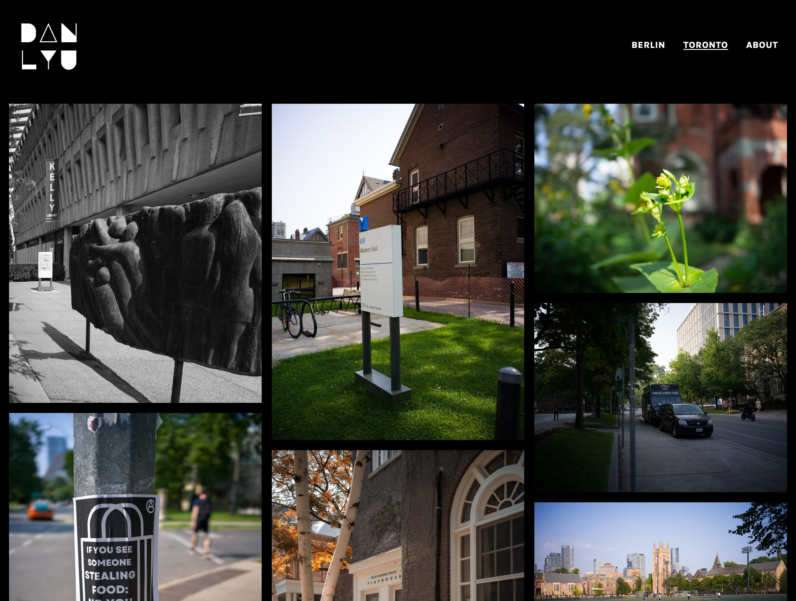
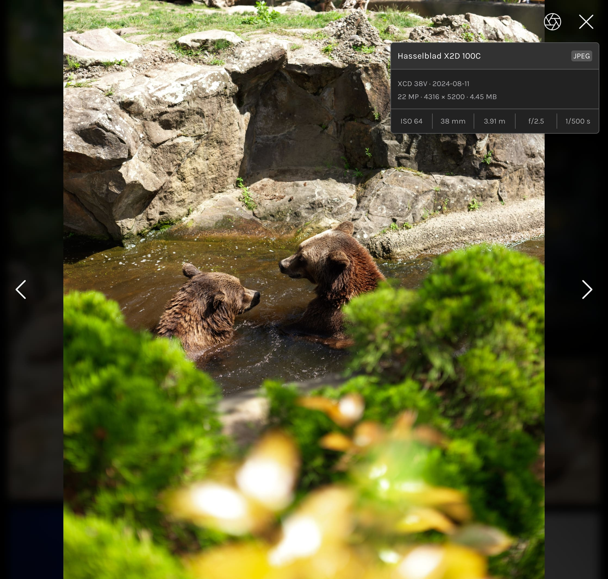
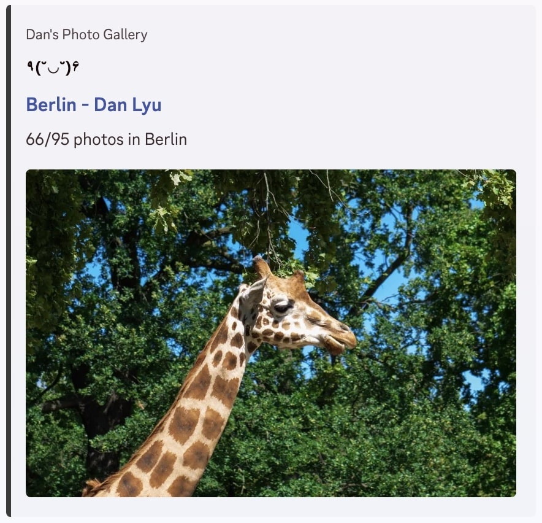

# Photosite


A simple photo portfolio and gallery website that generates
dynamic masonry layout and photo view from folders of images with
almost no configuration needed.

Project is built with Next.js, Tailwind CSS, and the [sharp image library](https://github.com/lovell/sharp) in 2 days.


## Features


* Exif data display
* Mobile swipe gestures
* Adaptive preview
* Folder based album generation
* Folder based navbar generation
* Dynamic and responsive masonry layout
* Fade in and out transition


## Getting started


### Installation

`docker-compose.yml`:

```yaml
services:
  photosite:
    image: meinya/photosite:latest
    restart: unless-stopped
    ports:
      - "3000:3000"
    environment:
      - RAW=/raw
      - PREVIEW=/preview
    volumes:
      - ./raw:/raw
      - ./preview:/preview
```
### Folder Structure

Place your images in a separate album folder with any name inside 
preview and raw folders. For instance:
* `/raw/Toronto/IMG_1.jpg`
* `/preview/Toronto/IMG_1.jpg`
> Note that the same image should have the same name in both folders.

This will **generate an album** called Toronto with its own navbar link.
All images inside the Toronto folder will be displayed in the album.
The **EXIF data** will be display in the corresponding photo view if it exists.





To set a cover page for HTML embeds, place a `cover.jpg` in the preview album folder:
`/preview/Toronto/cover.jpg`

To set a cover page for the root page, place a `cover.jpg` in the preview root folder:
`/preview/cover.jpg`



### Photo View

The photo view popup will initially display a preview image, followed by the full-resolution raw image once it has finished loading. 
A fade in and out animation is applied to transition from the previous image to the next.

